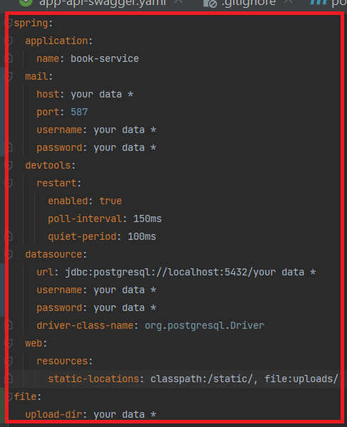

<h1>Bookstore</h1>
<h3>Overview</h3>
Bookstore is online service that provides features enabling users to interact with books.
The service has next features:

- User Authorization and Authentication
- Converting load books to .txt format
- Work with books(pagination, rating, filtering, search, etc)
- Admin panel for managing books, users
- User Settings

<h1>Technologies Used</h1>

 - Java
 - Spring(Core, Web, MVC, Data, Security, Validation)
 - PostgreSQL
 - Hibernate
 - Thymeleaf
 - Maven
 - Docker
 - Lombok
 - Swagger
 - HTML
 - CSS
 
<h3>Launch guide</h3> 

1.  Clone code from my repository 

 ```git clone git@github.com:kolyaGanyuck/book-service.git```


2. To run this project you will need to install

- JDK 17 or higher
- PostgreSQL

3. Set your data to the properties file in resource folder such as: 
- application.yaml


